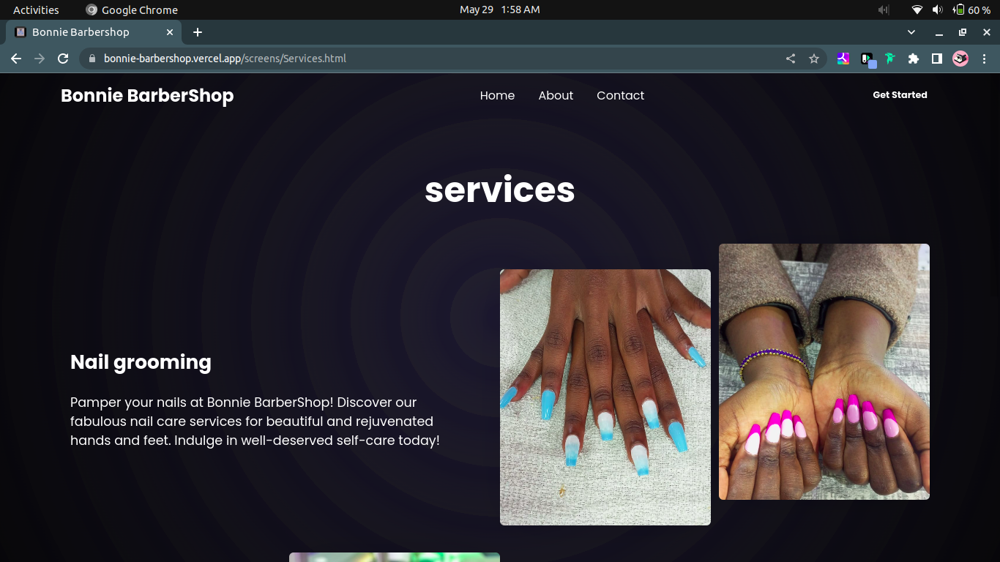

# Bonnie Barbershop Website

 This document provides an overview of the features, design, and functionality of our website, highlighting the beautiful UI and cool animations that enhance the user experience.

## UI Design

The Bonnie Barbershop website boasts a stunning UI design that combines aesthetics with user-friendliness. Our team of talented designers has meticulously crafted a visually appealing interface that reflects the essence of our barbershop. The color scheme is carefully selected to evoke a sense of sophistication and style, while maintaining readability and ease of navigation.

## Cool Animations

To create an engaging and immersive experience for our website visitors, we have incorporated cool animations throughout the site. These animations serve to captivate users, adding an element of interactivity and delight. From subtle hover effects to seamless transitions between sections, the animations bring the website to life, making the browsing experience enjoyable and memorable.

## Smooth Navigation

We understand the importance of seamless navigation, and our website ensures that users can effortlessly explore all the information they need. The navigation menu is strategically placed for easy access, providing clear and intuitive pathways to different sections of the website. Smooth scrolling and dynamic transitions between pages contribute to a seamless browsing experience.

## Responsive Design

At Bonnie Barbershop, we value accessibility and inclusivity. Our website is designed to be fully responsive, adapting to various screen sizes and devices. Whether accessed from a desktop, laptop, tablet, or mobile phone, users can enjoy a consistent and optimized experience, ensuring that they can easily engage with our content and services on any device.

## Optimized Performance

We prioritize website performance to provide users with a fast and smooth browsing experience. Our development team has implemented efficient coding practices, optimized image sizes, and minimized loading times to ensure quick and responsive page loading. This enables visitors to access information swiftly and enjoy a seamless interaction with the website.

## Get in Touch 

We encourage you to explore the Bonnie Barbershop website and discover the beautiful UI design and cool animations firsthand. Feel free to reach out to us through the provided contact information if you have any questions, feedback, or inquiries. We appreciate your interest and look forward to serving you at our barbershop!
You can also contact us at [Bonnie's BarberShop](https://bonnie-barbershop.vercel.app/)

Thank you for choosing Bonnie Barbershop!

